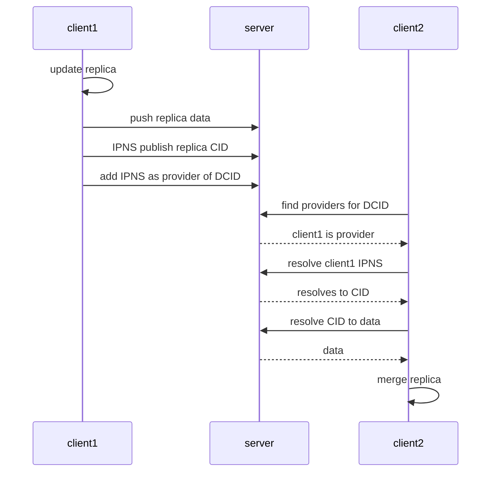

# Hosting Dynamic Content on IPFS

The InterPlanetary File System (IPFS) is a distributed, peer-to-peer file system designed to make the web faster, safer, and more resilient. Although IPFS excels at hosting static content, hosting dynamic content remains a challenge. This article presents a design for hosting dynamic content on IPFS using InterPlanetary Linked Data (IPLD), InterPlanetary Name Service (IPNS), and Provider Records.

## Understanding Key Components

### IPLD

[IPLD](https://ipld.io/) is a data model for linking and addressing data across distributed systems. In IPFS, IPLD stores immutable data, providing [content-addressed storage](https://en.wikipedia.org/wiki/Content-addressable_storage). Data stored in IPLD has a unique [Content Identifier](https://docs.ipfs.tech/concepts/content-addressing/) (CID) derived from its content, ensuring data integrity.

### IPNS

[IPNS](https://docs.ipfs.tech/concepts/ipns/) is a decentralized naming system that allows you to create a mutable reference to an immutable CID. With IPNS, you can create a persistent address that always points to the latest version of your content, even as it changes over time.

### PeerID

A [Libp2p peerID](https://docs.libp2p.io/concepts/fundamentals/peers/#peer-id) is a unique identifier for each node in the network, derived from a [public key](https://en.wikipedia.org/wiki/Public-key_cryptography). PeerIDs help find, identify, and communicate with other nodes.

### Provider Records

[Provider Records](https://docs.ipfs.tech/concepts/dht/) are a fundamental part of IPFS's Distributed Hash Table (DHT). When requesting IPFS content, a node queries the DHT for Provider Records associated with the requested CID. These records contain the PeerID of peers with the content, enabling the user to establish a connection and retrieve the data.

---
> **It's important to note that IPNS names can be derived from PeerIDs**
---

## Achieving Dynamicity

The main contribution is the novel use of Provider Records.
Instead of pointing from a CID to peerIDs of nodes hosting that content, they are used to point from a Dynamic-Content ID to IPNS names.
The resulting IPNS names each resolve to the latest CID of a device's local replica.

A device can:

  1. Query the provider records for some dynamic content
  2. Turn the returned provider peerIDs into IPNS names
  3. Resolve the IPNS names to the CID of a remote replica
  4. Traverse the remote replica's data and merge it locally

All of this can happen without knowing any previous collaborators, or needing them to be online as long as their replica data is kept available via a pinner.


---
> **The Merkle-DAG structure of IPFS enables traversing only the necessary pieces of content. Without this property, replication over the immutable data would not be realistic.**
---

### Dynamic-Content IDs

When searching the network for static content, a CID is used to find providers in the DHT. When searching for dynamic content a CID is still used. However, this CID does not belong to any static content. Instead, it is a permutation of the CID of an immutable manifest document that describes the dynamic content:

```js
manifest = { protocol: '/some-protocol/1.0.0', params: { network: 1 } }
cid = toCID(manifest)
dcid = toCID('dynamic' + cid)
```

---
> **There is an example at the end of this article which shows everything working together.**
---

## Viewed as a Replication Protocol

There exist protocols for dynamic content that use IPFS with Libp2p Gossipsub to replicate; one example is [OrbitDB](https://github.com/orbitdb).
In short, OrbitDB's replication protocol uses pubsub to find collaborators and share the latest root CIDs of replicas. Then these CIDs are used to fetch replicas from collaborators using IPFS.

The design presented in this article works similarly but replaces pubsub with Provider Records and IPNS. Essentially, all parts of replication get encoded into ~persistent IPFS components.

- Provider Records to find collaborators
- IPNS to point to the latest version of a replica

---
> **Swapping pubsub for ~persistent components makes building on history without any collaborators online possible.**

> **Titling this article 'Replication on IPFS' might have been more accurate, but 'Hosting Dynamic Content on IPFS' sounded waaay better.**
---

## Use-case: Edge-computed Applications

This design is particularly useful when paired with local-first databases.
These databases are partitioned (a.k.a. sharded) to only the interested parties.
It's common for only a few collaborators to be a part of a database, and there may be long periods without any of them online.
This context makes it challenging to build upon the history of collaborators, a challenge this design can potentially solve.

### Edge Devices

- Handle application logic and merging of replicas from other collaborators.
- Consist of a network of potentially unreliable peers that may come online and go offline at various times.
- Ensure the application history is available by commanding pinning servers.

### Pinning Servers

- Reliable storage servers that maintain the availability of dynamic content on IPFS.
- Pin IPLD replicas, and refresh IPNS and Provider Records for clients.
- Executes no app-specific code

### Replication

When other collaborators are online, use an application-specific replication protocol for real-time collaboration.
If not, query the DHT for collaborators' IPNS names to fetch and merge replicas from pinning servers.
After committing changes to the local replica, periodically push updates to pinning servers and refresh the IPNS to reference the new root.

---
> **Pinning servers in this context provide a general and reliable replication layer to fallback to when no other collaborators are online.**
---

## Roadblock, Workaround, and Hopeful Future

It should be clear now that using Provider Records this way was not intented.
Which brings us to the roadblock...

[DHT servers validate that the peerIDs inside received Provider Records match the peerID of the node adding them.](https://github.com/libp2p/specs/tree/master/kad-dht#rpc-messages)

This check makes adding Provider Records for multiple peerIDs to the DHT difficult.
Not great if you want to participate in multiple pieces of dynamic content as each will require its own IPNS name.
The workaround, for now, will involve spinning up ephemeral libp2p nodes to add each IPNS name as a provider every [22hours](https://github.com/libp2p/specs/tree/master/kad-dht#content-provider-advertisement-and-discovery).

Hopefully, in the future, it will be possible to delegate keeping Provider and IPNS records fresh to pinning servers.
This feature is needed for the full implementation of the edge-computed applications use-case and is not yet possible.

## Example

---
> **USES HELIA!!!! DHT IN JAVASCRIPT!! DYNAMIC CONTENT ON IPFS!?!?**
---

This example shows replication of dynamic content using IPLD, IPNS, and Provider Records.
There are 3 [helia](https://github.com/ipfs/helia) (ipfs) nodes running in a single script, named `client1`, `client2`, and `server`.
Libp2p is used by `client1` and `client2` to dial `server` and use the `/ipfs/kad/1.0.0` protocol.
This allows clients to add IPNS and Provider records to the DHT server.
Clients add IPLD data to `server` programmatically.


---
> **`client1`, `client2`, and `server ` are all in memory helia nodes created by a single script.**

> **IPLD data is added to the server by clients by accessing `server.blockstore.put` from within the script. As opposed to using an HTTP API like in any real usecase.**
---

### Usage

- Requires [npm and Node v18](https://docs.npmjs.com/downloading-and-installing-node-js-and-npm)

#### Clone the Repo

`git clone https://github.com/tabcat/dynamic-content.git`

#### Install Packages

`npm install`

#### Run Examples

There are two example scripts. One is interactive, meaning after the example runs a REPL is started with global variables available to operate the replication manually.

The scripts are `npm run example` and `npm run interactive`.

**If something is not working please open an [issue](https://github.com/tabcat/dynamic-content/issues)!**

### What's Happening?

The example consists 3 [helia](https://github.com/ipfs/helia) nodes, named `client1`, `client2`, and `server`.
The `server` represents a reliable machine used as a

1. IPLD pinning server
2. DHT server

---
> **IPNS and Provider records are both stored in the DHT.**
---

The clients are unreliable machines used to read and write dynamic content.
In the example `client1` does all the writing and `client2` does all the reading.



<br/>

Obviously this is a very high overview of what's going on.
Important to remember only IPLD/IPNS/Provider Records are being used.
It's a good idea to read [index.ts](./src/index.ts) (~200 LOC) to see what is happening up close.

### Read and Write Steps

Describes the process of read/write dynamic content to IPFS:

#### Writing

1. Make changes to local replica
2. Push replica data to IPLD pinner
3. Republish IPNS to point to new CID root
4. Add IPNS key as a provider of the Dynamic Content's ID

#### Reading

1. Query the DHT for Providers of the Dynamic Content's ID
2. Resolve providers IPNS keys to CIDs
3. Resolve CIDs to IPLD data
4. Merge changes with local replica

---
> **Note: in practice the DHT queries related to the Dynamic Content's ID just need to be ran on init, and then switch to a protocol meant for real-time replication with online collaborators.**
---

## Get Involved

Sound interesting? Get involved! Come [chat](https://matrix.to/#/#hldb:matrix.org)!

Have a question? Create an [issue](https://github.com/tabcat/dynamic-content/issues)!

[I](https://github.com/tabcat)'m working on this in [tabcat/zzzync](https://github.com/tabcat/zzzync).

## FAQ

**Q**: Why not just share an IPNS name to update?

**A**: IPNS names are not built to handle concurrent writes and should not be extended to do so. They are versioned documents that one device should be able to update. As shown here they are extremely useful for creating a system that can handle concurrent writes.

<br/>

**Q**: Isn't this going to be slow?

**A**: This design is meant to complement real-time replication by providing a general and reliable layer to fallback to. It adds two steps on top of resolving a CID, the DHT provider query, and the IPNS name resolutions. Implementers will need to think about how efficiently the IPLD layer can be replicated for their use-case.

<br/>

**Q**: Provider Records weren't built to support this use-case. Could this affect DHT measurements?

**A**: It's possible this could affect DHT measurements if it becomes prevalent. Using regular Provider Records this way would make it look like content providers are not online, because the peerIDs are used only for IPNS.
