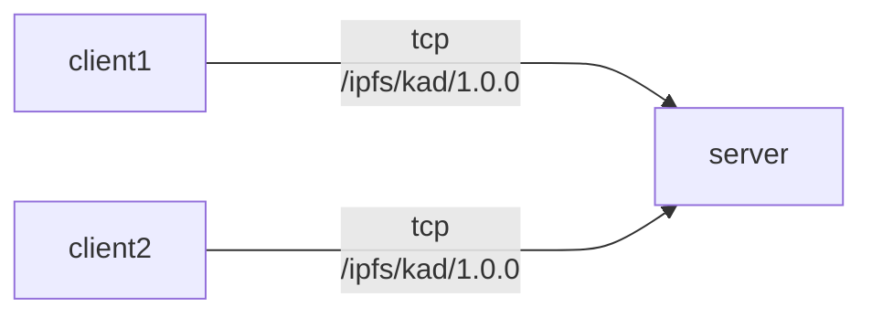
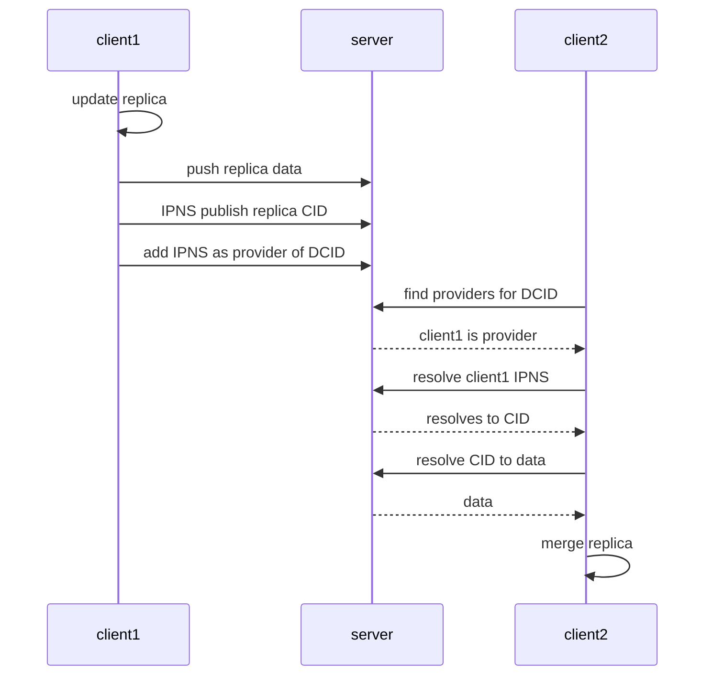

# Example

---
> USES HELIA!!!! DHT IN JAVASCRIPT!!
---

This example shows replication of dynamic content using IPLD, IPNS, and Provider Records.
There are 3 [helia](https://github.com/ipfs/helia) (ipfs) nodes running in a single script, named `client1`, `client2`, and `server`.
Libp2p is used by `client1` and `client2` to dial `server` and use the `/ipfs/kad/1.0.0` protocol.
This allows clients to add IPNS and Provider records to the DHT server.
Clients add IPLD data to `server` programmatically.

---
> **`client1`, `client2`, and `server ` are all in memory helia nodes created by a single script.**

> **IPLD data is added to the server by clients by accessing `server.blockstore.put` from within the script. As opposed to using an HTTP API like in any real usecase.**
---

## Usage

- Requires [npm and Node v18](https://docs.npmjs.com/downloading-and-installing-node-js-and-npm)

### Install Packages

`npm install`

### Run Examples

There are two example scripts. One is interactive, meaning after the example runs a REPL is started with global variables available to operate the replication manually.

The scripts are `npm run example` and `npm run interactive`.

**If something is not working please open an [issue](https://github.com/tabcat/dynamic-content/issues)!**

## What's Happening?

The example consists 3 [helia](https://github.com/ipfs/helia) nodes, named `client1`, `client2`, and `server`.
The `server` represents a reliable machine used as a

1. IPLD pinning server
2. DHT server

> IPNS and Provider records are both stored in the DHT.

The clients are unreliable machines used to read and write dynamic content.
In the example `client1` does all the writing and `client2` does all the reading.

 

Obviously this is a very high overview of what's going on.
Important to remember only IPLD/IPNS/Provider Records are being used.
It's a good idea to read [index.ts](./src/index.ts) (~200 LOC) to see what is happening up close.

## Read and Write Steps

Describes the process of read/write dynamic content to IPFS:

#### Writing

1. Make changes to local replica
2. Push replica data to IPLD pinner
3. Republish IPNS to point to new CID root
4. Add IPNS key as a provider of the Dynamic Content's ID

#### Reading

1. Query the DHT for Providers of the Dynamic Content's ID
2. Resolve providers IPNS keys to CIDs
3. Resolve CIDs to IPLD data
4. Merge changes with local replica

---
> **Note: in practice the DHT queries related to the Dynamic Content's ID just need to be ran on init, and then switch to a protocol meant for real-time replication with online collaborators.**
---
